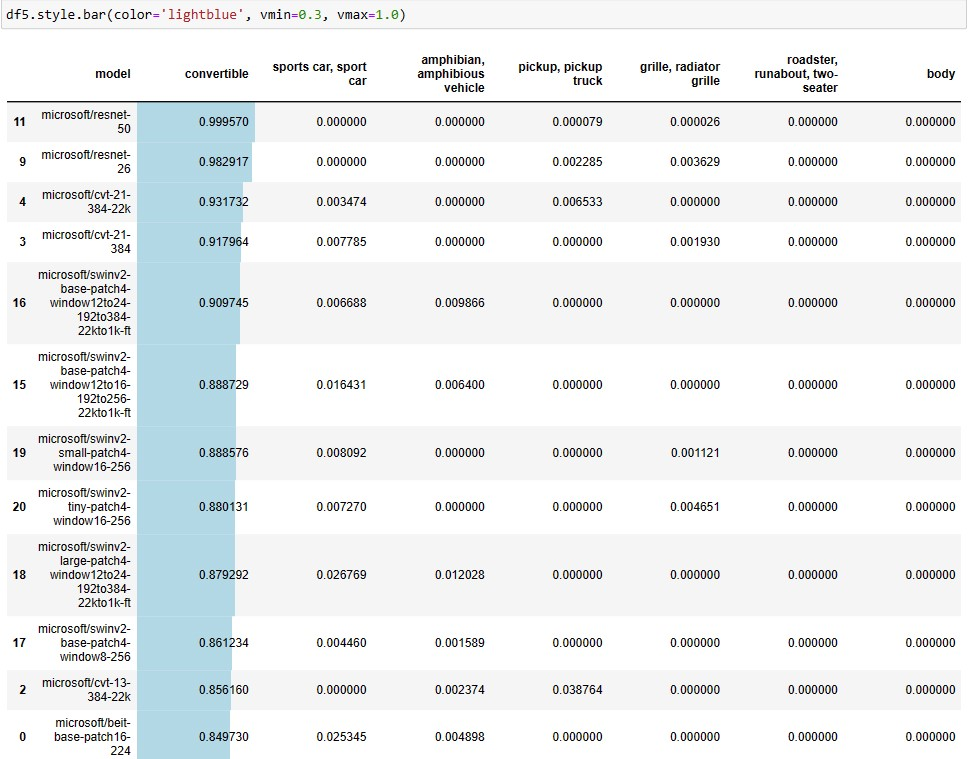

# Many models image classification with Transformers

We have many Image classification transformers models available. 
We can build a python function to test many models at the same time.

Reference: https://huggingface.co/models?pipeline_tag=image-classification&sort=downloads
  

  

18-Jan-2023
Serge Retkowsky | serge.retkowsky@microsoft.com | https://www.linkedin.com/in/serger/
