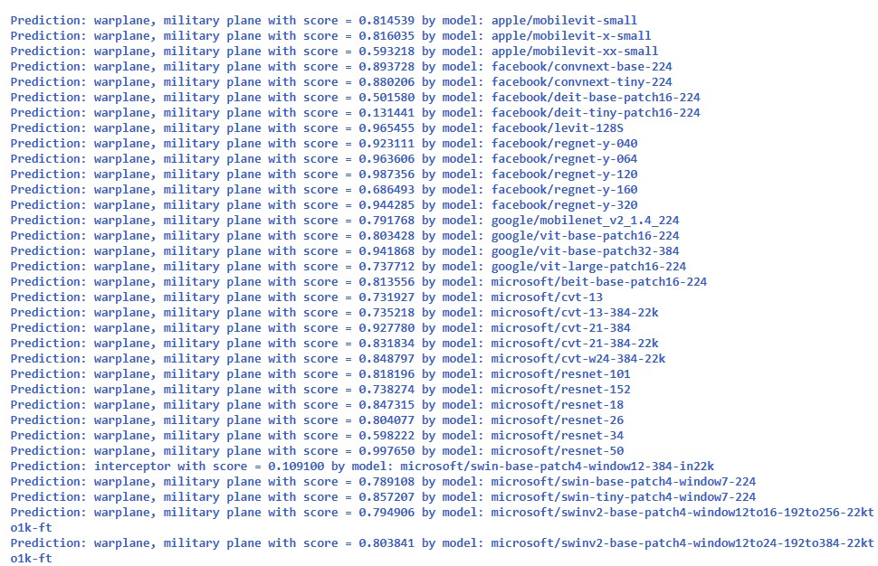

# Many models image classification with Transformers

We have multiple image classification transformer models available. 
We can use a python function to simultaneously test multiple models, similar to a basic AutoML for image classification using transformers.

## Reference
https://huggingface.co/models?pipeline_tag=image-classification&sort=downloads

## Python notebook
<a href="Many models image transformers for classification.ipynb">Python notenook</a>

## Definition of a list of images classification models

## Some results (overview)

  

18-Jan-2023
Serge Retkowsky | serge.retkowsky@microsoft.com | https://www.linkedin.com/in/serger/
